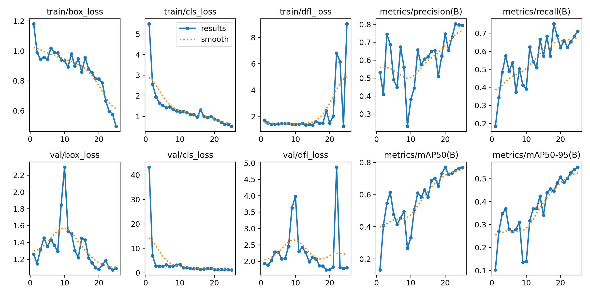
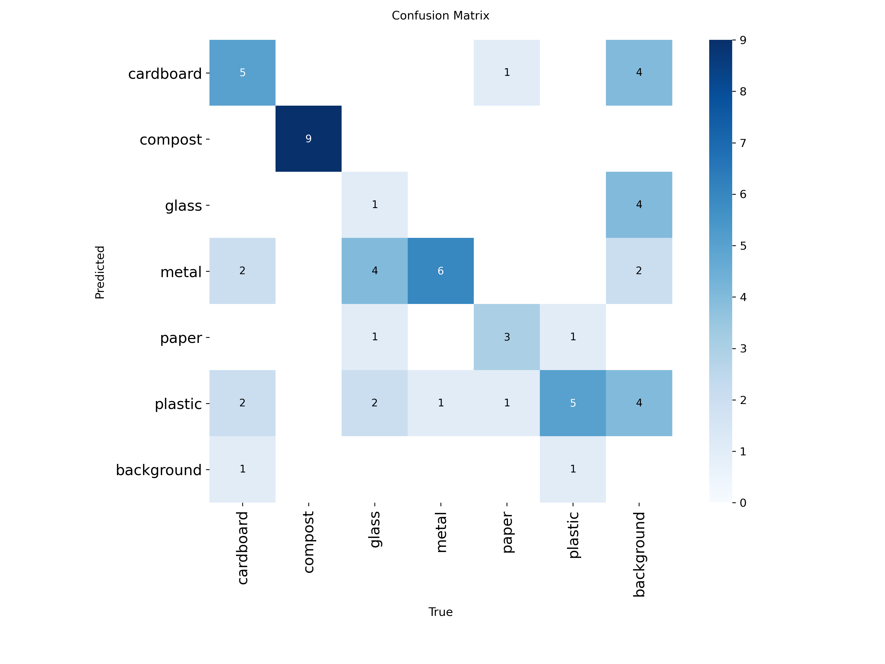
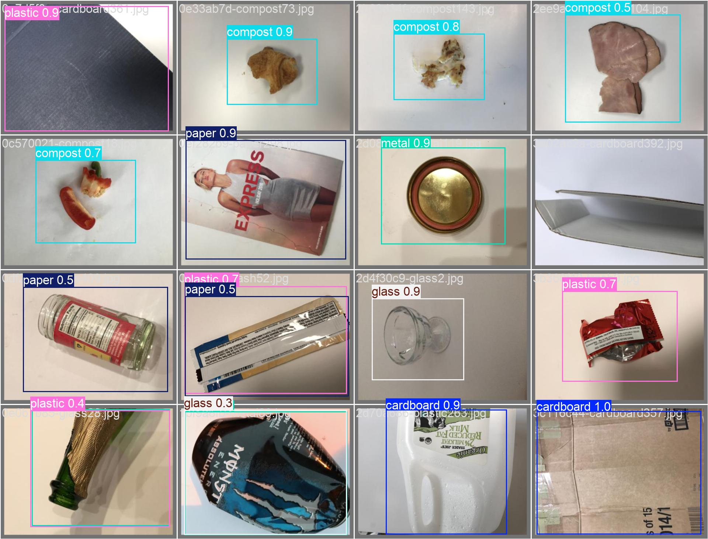

# Internship


---

## Assignment 1 – YOLOv8 Installation and Basic Inference

### Objective
To set up the Ultralytics YOLOv8 framework and verify its functionality by running object detection and segmentation on a sample image.

### Steps Performed
* Created a Python virtual environment.
* Installed the Ultralytics YOLOv8 package.
* Verified installation by running object detection on an online image.
* Performed segmentation using a pretrained YOLOv8 segmentation model.

### Commands Used
```
pip install ultralytics
yolo predict model=yolov8n.pt source="https://ultralytics.com/images/bus.jpg"
yolo predict model=yolov8n-seg.pt source="https://ultralytics.com/images/bus.jpg"
```

### Output
YOLO generated prediction outputs in the following folders:
```
runs/detect/predict/
runs/segment/predict/
```

---


# Internship Waste Detection — Assignment 3

## Objective
Process a video using YOLOv8 by converting it into frames, performing object detection on each frame, and reconstructing the processed frames into an output video.

## Tools Used
* Python
* Ultralytics YOLOv8
* FFmpeg
* Git/GitHub

---

## Steps Completed

1. Extracted frames from the video using FFmpeg.
2. Ran YOLOv8 pretrained model on the frames.
3. Generated detection results and reconstructed output video.
4. Observed the limitation of the pretrained model (could not detect litter well).

---

## Input
* `input.mp4`

## Output
* `output_video.mp4`

---

## Notes
The pretrained YOLOv8 model could not accurately detect roadside litter, demonstrating the need for a custom dataset and transfer learning for this task.

## Assignment 4 – Action on Detection

For each frame, the presence of a selected object (`person`) was checked.
If detected, an action was triggered in the form of:
* Logging the frame name
* Counting total detection occurrences

This logic demonstrates how detection results can be used to trigger
real-world actions such as alerts or automation.

# ♻️ Waste Detection & Segregation using YOLOv8

An end-to-end Computer Vision project developed during my AI/ML Internship. This project identifies and classifies waste into six categories to assist in smart waste management and sustainability.

## 🚀 Project Overview
This project involves a custom-trained **YOLOv8s** model capable of detecting waste in real-time video streams. The model was trained using **Transfer Learning** on a curated dataset.

### Detected Classes:
- 📦 **Cardboard**
- 🍎 **Compost**
- 🍾 **Glass**
- ⚙️ **Metal**
- 📝 **Paper**
- 🥤 **Plastic**

---

## 📊 Final Performance Metrics
The model was trained for **25 epochs** on an **Intel Core i3-4150 CPU**. Despite hardware constraints and training interruptions, the model achieved impressive results:

| Metric | Value |
| :--- | :--- |
| **mAP50 (Accuracy)** | **76.8%** |
| **Precision** | **79.7%** |
| **Recall** | **70.9%** |

### Class Breakdown (mAP50):
- **Compost:** 99.5% (Near Perfect)
- **Metal:** 89.8%
- **Cardboard:** 78.8%
- **Plastic:** 50.5% (Most challenging class)

---

## 🛠️ Key Visualizations
Below are the training results and the AI's "Validation Exam" performance:

### 1. Training Results
Shows the loss decreasing and accuracy increasing over 25 epochs.


### 2. Confusion Matrix
Displays how accurately the model distinguished between different waste types.


### 3. Prediction Samples
Visual proof of the model detecting waste in the validation dataset.


---

## 📂 Project Structure
- `dataset/`: Training and Validation images/labels (Excluded from GitHub due to size).
- `runs/detect/train3/weights/best.pt`: The final trained model weights.
- `train_waste_model.py`: The script used for training.
- `resume_training.py`: Script used to recover training after system crashes.
- `final_inference.py`: Script to run the model on test videos.

---

## 🔧 How to Run
1. Install dependencies:
   ```bash
   pip install ultralytics opencv-python
